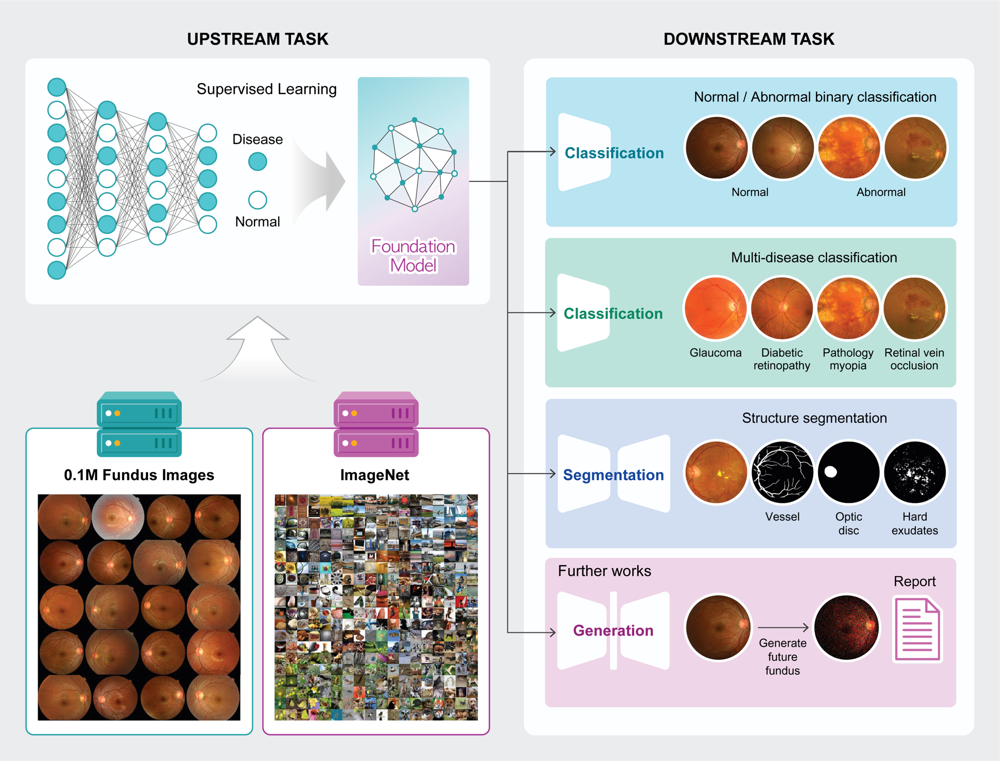

## *"A Disease-Specific Foundation Model Using Over 100K Fundus Images: Release and Validation for Abnormality and Multi-Disease Classification on Downstream Tasks"* 
---
The repository is currently empty. All codes will be uploaded after publication.
### Model Weight: 
    - 1. [Fundus](https://drive.google.com/file/d/1RzzFASggklv-L_uU-8AxMmcWuMYMuhR2/view?usp=drive_link)
    - 2. [ImageNet+Fundus](https://drive.google.com/file/d/1TL3rt8h5EJmZY0o-NeDRzEq8Qu8zfs-3/view?usp=drive_link)
    
- contact: balinda@snu.ac.kr; boajang97@gmail.com